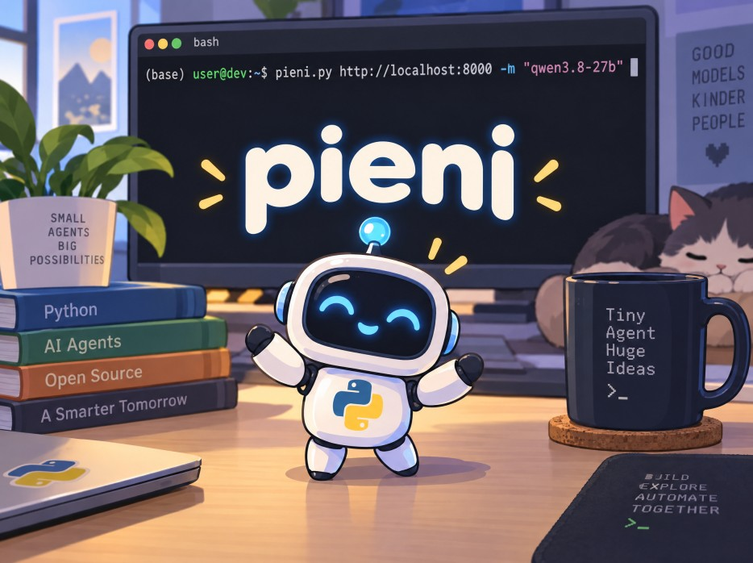

# pieni
A tiny AI agent written in Python. Despite being just one &lt;1000 lines file, it has minimal sandbox, destructive command guard (DCG), adapters for multiple LLM providers, context compacting and interactive mode + headless CLI. Despite being very small in size, it can do the coding for you and access the net. You can easily fork and extend it.

Pieni is perfect way to learn how AI agents work and you can fork and use it how you want. The word "pieni" is Finnish and means "small". 

Pieni supports the following providers (set the API key as environment variable before using pieni):
- OpenAI (OPENAI_API_KEY)
- OpenRouter (OPENROUTER_API_KEY)
- Deepseek (DEEPSEEK_API_KEY)
- Custom base URL, including local models e.g. llama-server / llama.cpp, ollama, LM studio, slang, vLLM



## CLI usage:
```console
pieni provider -m "model name" # start agent with provider and mode name
pieni provider -m "model name" -s "API secret key" # It is highly recommended to use environment variable to store the API keys
pieni deepseek -m "deepseek-flash"
pieni openai -m "gpt-6-luna"
pieni openrouter -m "glm-5.3-flash"
pieni http://localhost:30000 -m "qwen3.6-35b-a3b"
```

## headless mode
```console
pieni provider -m "model" -r "prompt" # -r/--r "run agentic prompt"
pieni openai - m "gpt-6-luna" -r "Explain LLMs in less than 100 words."
```

## The agent mode has the following commands:
```console
/compact {all] # compact context, 75% auto compact limit, /compact all removes everything from context.
/permissions auto|yolo
/provider [provider-name]
/model [model-name]
/reasoning [reasoning-effort]
/help # very concise help
/quit # quit
/exit # same
```
